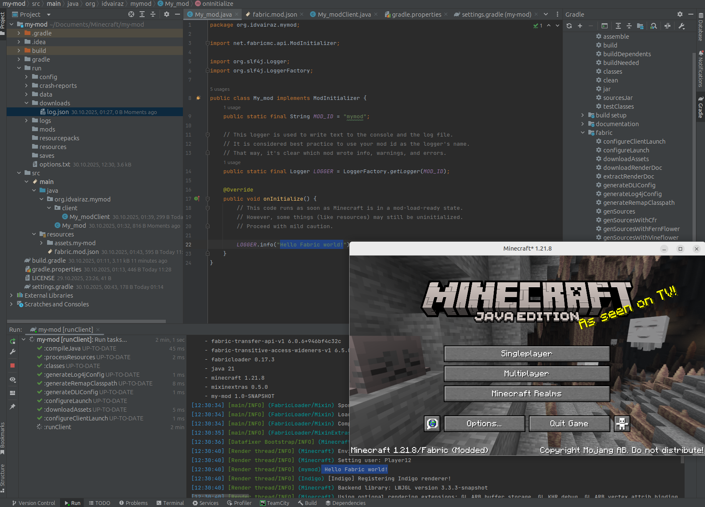
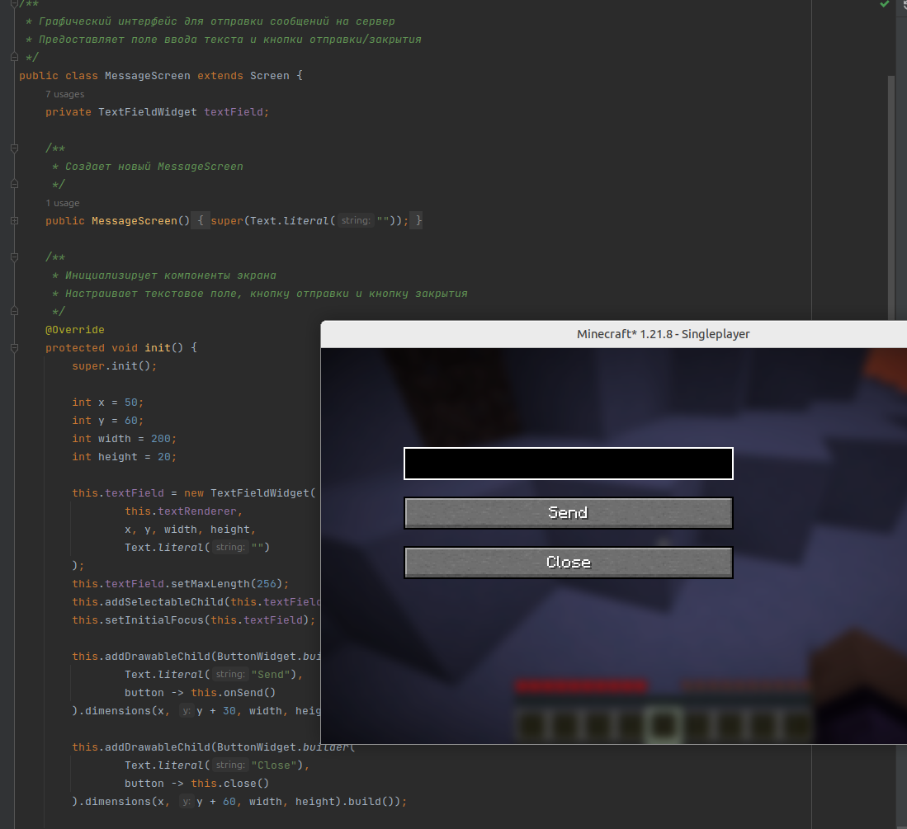
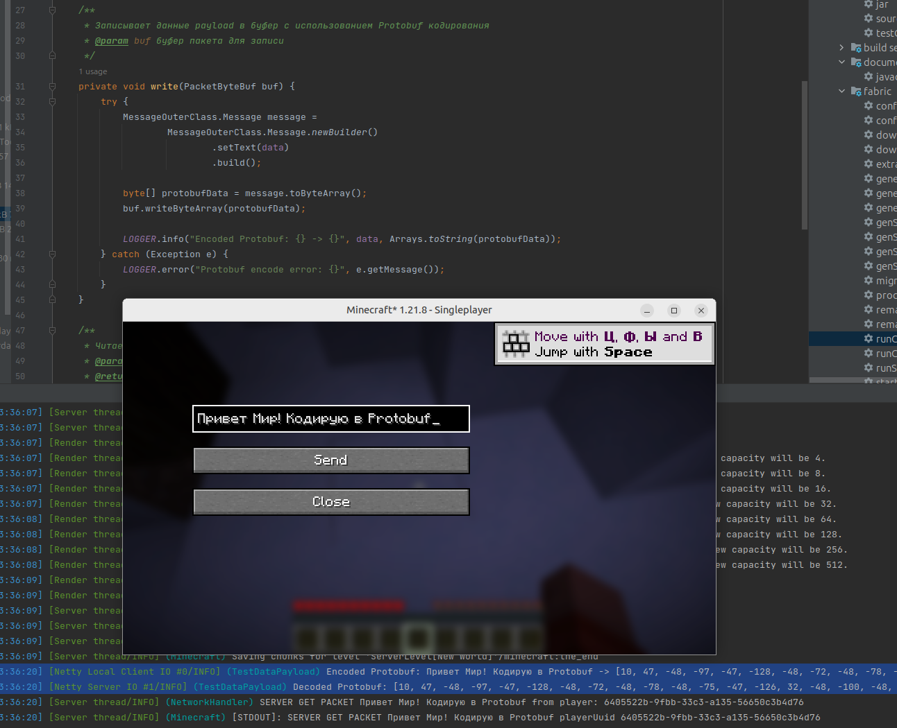
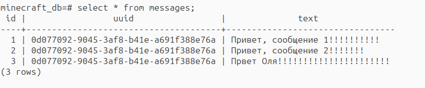

### Выполненные действия:

**Разворачивание инфраструктуры и запуск клиента**

После запуска в лог выводится "Hello Fabric world!", как показано на скриншоте

**1. Создание Screen'а с полем ввода текстового сообщения и кнопкой отправки**

- Реализован класс `MessageScreen`, расширяющий `Screen` из Minecraft API
- Добавлено текстовое поле `TextFieldWidget` с ограничением длины 256 символов
- Созданы две кнопки: "Send" для отправки и "Close" для закрытия окна
- Настроена обработка клавиши Enter для быстрой отправки сообщения
- GUI открывается по нажатию клавиши Z (KeyBinding)

**2. Реализация Protobuf 3 кодирования/декодирования**

- Создан `.proto` файл с сообщением `Message { string text = 1; }`
- Настроен Gradle плагин для автоматической генерации Java классов из Protobuf
- Реализован кастомный `TestDataPayload` для сетевой передачи
- На клиенте сообщение кодируется в Protobuf перед отправкойd
- На сервере сообщение декодируется из Protobuf формата

**Настройка сетевого взаимодействия клиент-сервер**

- Использована Fabric Networking API для обмена пакетами
- Регистрация кастомного payload через `PayloadTypeRegistry`
- Клиентская часть: `ClientPlayNetworking.send()`
- Серверная часть: `ServerPlayNetworking.registerGlobalReceiver()`
- Обеспечена надежная доставка сообщений между клиентом и сервером

**3. Интеграция PostgreSQL через Hibernate JPA**

**База данных:**
- Поднят PostgreSQL в Docker контейнере

- Создана таблица `messages` с полями:
  - `id SERIAL PRIMARY KEY`
  - `uuid UUID NOT NULL` (идентификатор игрока)
  - `text VARCHAR(256) NOT NULL` (текст сообщения)
  
  в которую записываются декодированные сообщения

**Hibernate конфигурация:**
- Настроен `EntityManagerFactory` с параметрами подключения
- Создан `MessageEntity` класс с JPA аннотациями
- Реализован паттерн Repository для работы с данными
- Настроены транзакции и управление соединениями

### Сборка и развертывание

- Настроен Gradle 8.14 с Fabric Loom
- Добавлены все необходимые зависимости:
  - Hibernate Core 6.6.3.Final
  - PostgreSQL JDBC Driver 42.7.4  
  - Protobuf Java 3.25.3
- Сборка успешно завершается без ошибок

